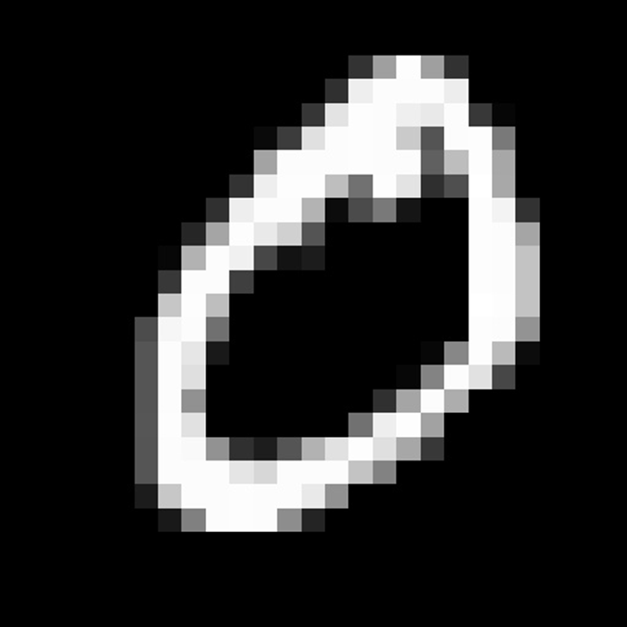
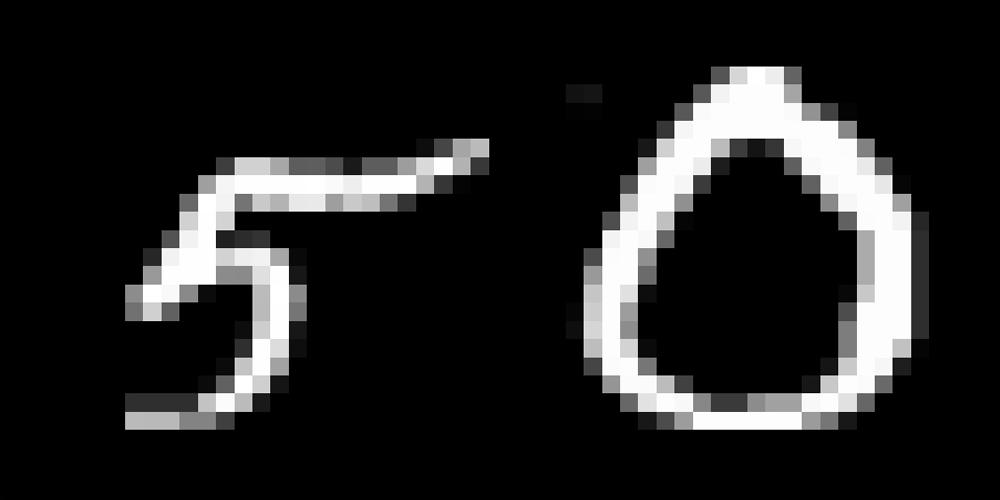
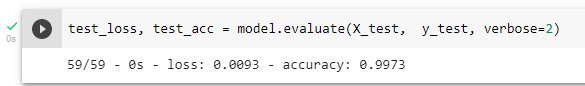

# DESAFIO - ESTÁGIO IA VISÃO 

## ⩥ 📋 Sobre o MNIST

 MNIST é um banco de imagens de dígitos de 0 a 9 desenhados a mão, ele contém 60.000 dados de treino e 10.000 dados de teste. É um ótimo banco de imagens para quem quer aprender  sobre visão computacional e classificação de dados.

<h1 align='center'>
  
<h1/>

## ⩥ 🏆 Sobre o Desafio
   
O desafio proposto é de criar um classifiador capaz de diferenciar os números 5 e 0 do dataset MNIST.
  
<h1 align='center'>
  
<h1/>

  
## ⩥ 🛠 Resolução
  
  Dividi minha resolução em 3 partes:
  
<ul>
  <li>
<b>Tratamento dos Dados;</b>

Divisão dos dados dos dígitos 0 e 5 e normalização dos valores. 
</li>
  <li>
<b>Criação e optimização de Rede Neural Convolucional; </b>
</li>

Análisando a acurácia para diferentes combinações de hiperparâmetros para o classificador com o intuito de escolher a melhor combinação para este problema de classificação <i>(gridsearch method)</i>. 
</li>
  <li>
<b>Análise dos Resultados obtidos pelo classificador escolhido; </b>
</li>
  
Utilizando os dados de teste para obter a estimativa da acurácia esperada para o classificador.

</ul>
  
  
### ⪧ 🔧 **Tratamento dos Dados**
  
  Após a divisão dos dados das imagens dos dígitos 0 e 5 o nosso banco de treino é composto por 11344 imagens, de dimensões 28x28. Os valores variam de 0 a 255, ou seja as imagens estão em escala de cinza. Valores grandes podem dificultar e prolongar o tempo de treinamento dos classificadores, por isso é recomendável a normalização dos dados, no caso dessas imagens podemos apenas dividir todos os valores por 255, o que resultará em valores variando de 0 a 1. 
  
### ⪧ ⚙ **Criação e optimização de Rede Neural Convolucional**
  
  O classificador escolhido para esse desafio foi a Rede Neural Convolucional, ou CNN *(Convolutional Neural Network)*, tendo em vista que este classificador é considerado estado da arte para classificação de imagens pois a CNN consegue identificar padrões nas imagens de forma muito eficiente.
  
  Para criação de uma CNN muitos paramêtros devem ser definidos, como batch size, activation, optmizer dentre outros. O que nos leva a pergunta: Qual conbinação desses parametros nos levará aos melhores resultados?
 
  Para responder essa pergunta podemos simplesmente testar várias combinações e comparar os resultados. O arquivo [Tabela hiperparametros MNIST.xlsx](https://github.com/Tavrss/Cyberlabs/blob/main/Tabela%20hiperparametros%20MNIST.xlsx) apresenta 360 combinações dos paramêtros citados e suas respectivas acurácias e loss.
  Após análise dessa tabela podemos definir quais combinações levam ao melhor resultado. Dentre as acurácias de 100% os parametros com maior frequência foram escolhidos.
  Desse modo foi defindo os parametros para a CNN:
  - Batch Size = 256
  - Activation = tanh
  - Optmizer = Nadam
  
### ⪧ 📊 **Análise dos Resultados obtidos pelo classificador escolhido**
  
  A acurácia obtida somente com os dados de treino (100%) é um valor muito otimista pois o modelo foi otmizado para classificar exatamente esses dados, a acurácia para dados novos tende a ser menor. Outro problema que pode ter ocorrido é o overfitting que acontece quando o modelo se ajusta demais aos dados de treino e não consegue generalizar muito, e desse modo pode não conseguir classificar dados novos.
 
  Para avaliarmos o desempenho do modelo criado e garantirmos que não houve overfitting devemos testar o modelo com dados que não foram usados em nenhum momento para a sua criação, treinamento ou otimização. 
 
  Para o meu modelo a acurácia dos dados de teste foi de 99,73%.

<h1 align='center'>

<h1/>
  
   
**Toda esse processo está documentado no arquivo [main.py](https://github.com/Tavrss/Cyberlabs/blob/main/main.py).**
