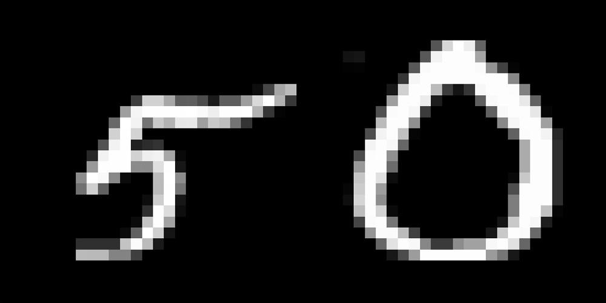

# DESAFIO - ESTÁGIO IA VISÃO 

## • 📋 Sobre o MNIST

#### MNIST é um banco de imagens de dígitos de 0 a 9 desenhados a mão, ele contém 60.000 dados de treino e 10.000 dados de teste. É um ótimo banco de imagens para quem quer aprender  sobre visão computacional e classificação de dados.

<h1 align='center'>
  
<h1/>

## • 🏆 Sobre o Desafio
   
O desafio proposto é de criar um classifiador capaz de diferenciar os números 0 e 5 do dataset MNIST.
  
<h1 align='center'>
  
<h1/>
